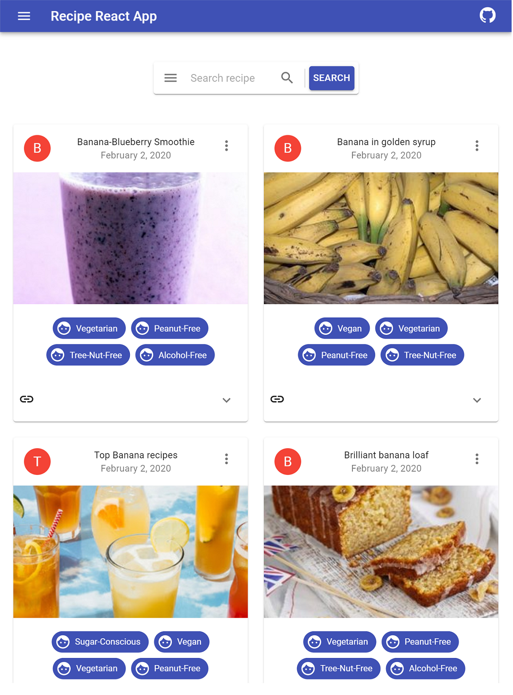
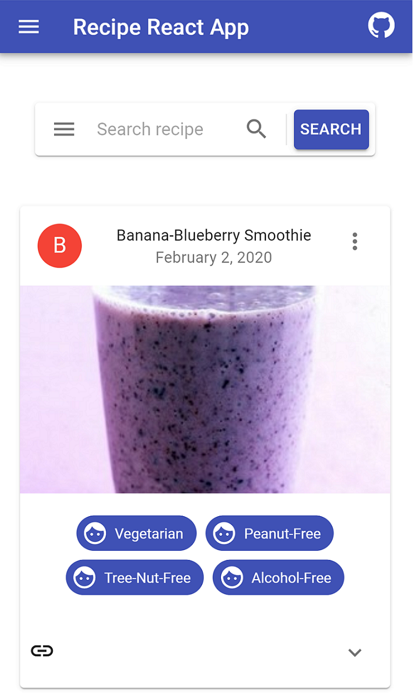

# Recipe app with React

https://banirudh-react-recipe-app.herokuapp.com

# Technologies used
  - React.js
  - Node
  - HTML
  - CSS
  - Heroku
  
# External Api used
  - https://www.edamam.com/
  - https://developer.edamam.com/edamam-docs-recipe-api

  
# Process to run the code
  1. Make sure that you have the latest version of Node.js and npm installed.
  2. Move to the appropriate directory: cd <Recipe_React>.
  3. Install the React Recipe app dependencies using. 
  4. Run "npm install" to install dependencies.
  5. After the dependencies are installed run "npm start".
  6. The application will run on local "http://localhost:3000".

# Features in the Application 
  1. This applications loads recipies using edamam-recipe-api.
  2. Chicken recipes are loaded by default.
  3. One can load different recipes using the search functionality.
  
## Web view in desktop

## Web view in ipad

## Web view in mobile
